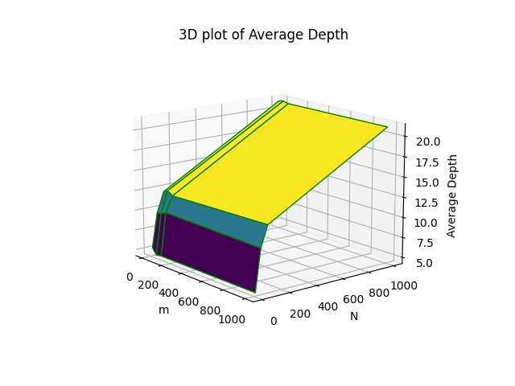

# DSA Assignment -  2

## Random BST

### Overview 

The function `randomBST(int n)` takes an integer n as input and inserts n nodes into the unbalanced Binary Search Tree (BST) in the range [1, N] in random order.

### Time Complexity 

It takes O(n) to fill the array with integers in the range [1, N]. It takes O(n) to shuffle the elements in the array. It takes O(nh) to insert elements into the BST where h is the maximum height of the tree. For an unbalanced BST the maximum height can be equal to the total number of nodes in the tree. Therefore worst case time complexity for an unbalanced BST is O(n^2). For a balanced BST h = log(n). Time complexity of insertion in a balanced BST is O(nlogn).

Worst case time complexity for this function is O(n^2) [unbalanced] / O(nlogn) [balanced]

## Average Depth

### Overview 

The function `avgDepth()`runs `randomBST(int n)` for each value of `n = [10, 50, 100, 1000]` and prints the average for each n over `m = [10, 50, 100, 1000]`iterations each. 

### Time Complexity 

The outer loop has worst case time complexity O(max(M)). The inner loop will run O(max(N)) number of times worst case. `deleteBST()`has worst case time complexity O(n). We have covered time complexity of `randomBST()` above. Hence the overall time complexity of the function is 

O(max(M) x max(N) x max(N)) for an unbalanced BST and O(max(M) x max(N) x log(max(N))) for a balanced BST.

### Data

|          |  N   |  10   |  50   |  100   |  1000  |
| :------: | :--: | :---: | :---: | :----: | :----: |
|  **M**   |      |       |       |        |        |
|  **10**  |      | 4.400 | 9.100 | 12.000 | 20.700 |
|  **50**  |      | 4.480 | 9.800 | 12.840 | 20.760 |
| **100**  |      | 4.850 | 9.990 | 12.170 | 21.280 |
| **1000** |      | 4.654 | 9.835 | 12.283 | 20.990 |

### Observations

Despite worst case for height while inserting into an unbalanced BST being O(n) we observe that for random input, the average case is much closer to O(logn) than it is to O(n). However while it is much closer to `logn` than it is to `n` it is not `logn` either.

Taking the ratio of our experimentally obtained values [for M=1000] to log_2(n) we get the following table

|  N   | Experimentally obtained values (H) | log_2(n) | H/log_2(n) |
| :--: | :--------------------------------: | :------: | ---------- |
|  10  |               4.654                |  3.321   | 1.401      |
|  50  |               9.835                |  5.643   | 1.742      |
| 100  |               12.283               |  6.643   | 1.849      |
| 1000 |               20.990               |  9.965   | 2.106      |

The ratio keeps getting worse for larger and larger values of N. For N=1000, the height is almost double what we can expect from a balanced BST.